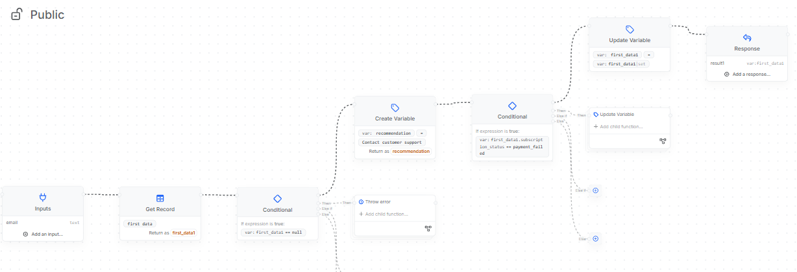

# 🎵 RhythmRelief AI: Advanced Technical Assistant

**An AI-powered technical support agent for a Spotify-clone app. Built with Dify (RAG) and Xano API to provide real-time account-based assistance and automated troubleshooting.**

---

## 🚀 Live Demo
**Experience the project here:** [SupportStream Live Demo](https://energetic-ocelot-trot.vercel.app/)

The bot is deployed as a persistent side-panel assistant within a high-fidelity Spotify-clone interface built with **DYAD**, allowing users to troubleshoot issues and manage their accounts without leaving the music player.

## 🧠 System Architecture
* **Orchestration:** [Dify.ai](https://dify.ai/)
* **Backend & API:** [Xano](https://www.xano.com/)
* **UI/UX:** Built with **DYAD** for a seamless, modern streaming interface.
* [cite_start]**Knowledge Base:** Multi-document RAG system utilizing proprietary app guides[cite: 1, 20, 34].

---

## 🛠 Features

### 1. Intelligent Knowledge Retrieval (RAG)
The agent leverages specialized documentation to resolve user queries:
* [cite_start]**Offline Listening:** Explains the 10,000-song limit per device [cite: 4] [cite_start]and the "30-Day Rule" requiring users to go online once every month to keep downloads[cite: 5, 6].
* [cite_start]**Audio Quality:** Guides users through setting levels from "Low" (24kbit/s) [cite: 11] [cite_start]to "Very High" (320kbit/s for Premium)[cite: 12, 13].
* [cite_start]**New Features:** Supports users with the AI DJ [cite: 20][cite_start], Smart Shuffle [cite: 24][cite_start], and Jam real-time listening sessions[cite: 28, 29].
* [cite_start]**Technical Troubleshooting:** Provides step-by-step guides for "Clean Reinstalls" on Android and iOS to clear corrupted cache[cite: 45, 46, 47].

### 2. Personalized API Workflows (Xano)
The agent queries a **Xano Backend** to check the user's live account status:
* **Status Verification:** Checks if a user is `active`, `payment_failed`, or `suspended`.
* **Dynamic Logic:** If the Xano flow detects a `payment_failed` status, it triggers a recommendation variable to guide the user toward billing support.

---

## 📊 Technical Deep Dive: Xano Integration

**The Workflow Logic:**
1. **Input:** Agent sends user `email` to the Xano endpoint.
2. **Get Record:** Xano retrieves the specific row for that user.
3. **Conditional Check:** * If `subscription_status == payment_failed`, the flow updates the `recommendation` variable to "Contact customer support".
   * [cite_start]If user data is `null`, an error is thrown to prompt a login verification[cite: 35, 38].
4. **Response:** Returns structured JSON to Dify.

---

## 📸 Project Gallery

### I. The Database (Xano)

### II. API Logic Stack

---

## ⚙️ Setup & Installation
1. **Dify:** Upload the `.txt` files to the Knowledge section. [cite_start]Set RAG priority for Troubleshooting[cite: 34].
2. **Xano:** Import the schema and configure the API endpoint in Dify's "Tools".
3. **App Integration:** The interface is built using **DYAD** components.

---

*This project was developed to demonstrate the power of combining No-code backends with LLM orchestration.*
